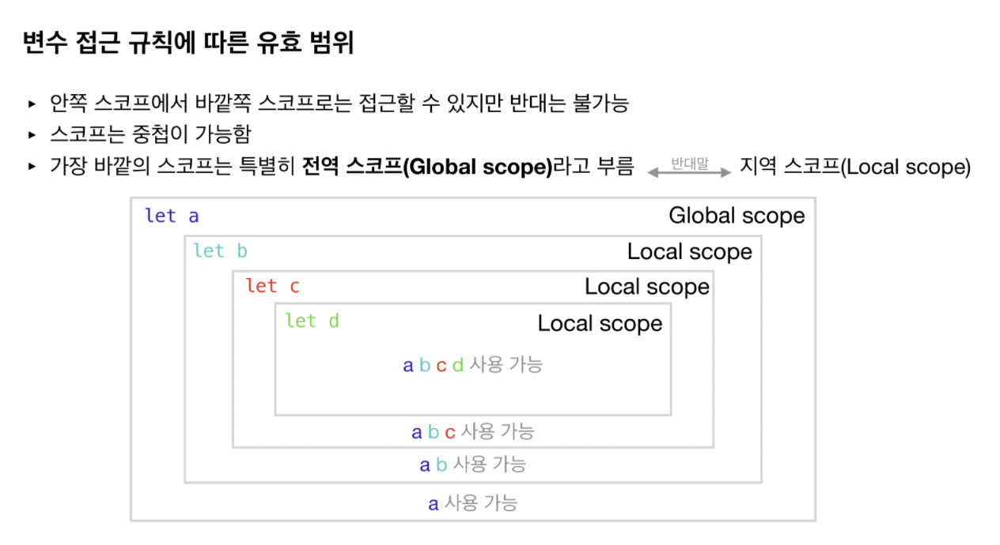

#JS/Node 핵심개념, 주요 문법

## 원시자료형과 참조자료형(10.6 TIL 참고)

##스코프

**범위**를 의미하고 **바깥쪽 스코프의 선언값은 안쪽스코프에서 사용가능**하지만 <span style="color:red">**반대로는 불가능**</span>하다.



<span style="color:green">*codestates자료 참조*</span>

Global scope의 변수가 Local scope 안에서 중복으로 사용되면(*let선언*) Local scope가 더 높은 우선순위를 가진다.

```js
let me = "Gunpyo";
function name(){
  let me = "Minho";
	console.log(me); // "Minho"
}
console.log(me); // "Gunpyo"
name();
console.log(me); // "Gunpyo"
```

```js
let me = "Gunpyo";
function name(){
  me = "Minho";
	console.log(me); // "Minho"
}
console.log(me) // "Gunpyo"
name();
console.log(me); // "Minho"
```


#### 스코프 종류

- 중괄호로 둘러싼 범위(block scope: 블록스코프)

```js
if(true) {
  console.log('Gunpyo')
} // 스코프범위만
for(let i = 0; i < 2; i++) {
  console.log(i)
}
{ }
```


- 함수로 둘러싼 범위(function scope: 함수스코프)

```js
function name(){
  return 'Gunpyo'
}  //전체 범위 다 해당

let age = function () {
  return 29
} // function부터 scope범위에 해당
```

<span style="color:orange">***화살표 함수**는 **블록스코프**로 취급된다.*</span>


### var, let, const 의 차이는?

var키워드는 화살표함수를 제외하고 블록스코프를 무시한다. 블록스코프로 단위를 구분하려면 let키워드를 사용하면 된다.

const키워드는 재할당이 되지 않기 때문에 상수처럼 정해져서 변하지 않는 값에 사용하는게 좋다.

평소에는 let키워드를 위주로 사용하자.

|           |            let             |           const            |     var     |
| :-------: | :------------------------: | :------------------------: | :---------: |
| 유효 범위 | 블록 스코프 및 함수 스코프 | 블록 스코프 및 함수 스코프 | 함수 스코프 |
| 값 재할당 |            가능            |           불가능           |    가능     |
|  재선언   |           불가능           |           불가능           |    가능     |

***주의점***

- var로 선언된 전역 변수 및 전역 함수는 window객체(browser only)에 속하게 된다.

- 전역변수에 너무 많은 변수를 선언하면 좋지 않다.

  다른 함수 혹은 로직에 의해 의도치않은 변경이 발생할 수 있다.

- var는 블록 스코프를 무시하고, **재선언을 해도 에러를 내지 않는다**.

  (let과 const를 사용하자)

- var로 선언한 전역 변수가 window의 기능을 덮어씌울 수 있다.

- 선언키워드 없이 변수를 할당하면 var로 할당한듯이 된다.

- 선언 없는 변수 할당 금지


[상세하게 알아보자](https://www.howdy-mj.me/javascript/var-let-const/)


## 클로저(Closure)

처음에는 외부함수에 리턴값이 내부함수 일때, 외부함수를 클로저라고 부르는줄 알았다. BUT!!! **외부함수에 접근이 가능한 내부함수를 클로저함수** 라고한다.

```js
function func(x) {
  return function (y){
    return x - y;
  }
}
func(3)(1) // 2
//여기서 closure함수는 function(y){ return x - y } 이다.

const func10 = func(10);
func10(3) // 7
func10(11) // -1
```

실용적인 예제

- HTML문자열 생성기

```js
const tagMaker = function(tag){
  return function(content){
    return `<${tag}>${content}</${tag}>`
  }
}
const divMaker = tagMaker('div');
const buttonMaker = tagMaker('button');
divMaker('div입니다') // '<div>div입니다</div>'
divButton('버튼입니다') // '<button>버튼입니다</button>'
```

- 클로저 모듈 패턴

  - 함수선언식

  ```js
  const makeCounter = function(){
    let value = 0;
    return {
     increase : function(){
       return value = value + 1
     },
     decrease : function(){
      return value = value - 1
     },
     getValue : function(){
      return value = value
     }
    }
  }
  ```

  

  - 화살표 함수식

  ```js
  const makeCounter = () => {
    let value = 0;
    return {
      increase: () => {
        value = value + 1
      },
      decrease: () => {
        value = value - 1
      },
      getValue: () => value
    }
  }
  ```

  위 두 함수식 중 하나일 때,

  ```js
  const count1 = makeCounter();
  const count2 = makeCounter();
  count1 // {increase: f, decrease: f, getValue: f}
  
  count1.increase();
  count1.increase();
  count1.decrease();
  count1.getValue(); // 1  (1+1-1 = 1)
  
  count2.decrease();
  count2.decrease();
  count2.getValue(); // -2  (-1-1 = -2)
  ```

  

####CheckPoint

클로저가 가장 유용하게 사용되는 상황은 현재 상태를 기억하고 변경된 최신 상태를 유지하는 것이다.

클로저의 개념을 활용해 클릭 이벤트시, Circle을 나왔다 안나왔다 하게 만들어라.

- css를 조작

```js
isShow = !isShow;
box.style.display = isShow ? "block" : "none";
```

- css를 조작하는데 있어보이게끔!

```js
box.style.opacity = isShow ? 1 : 0 ;
box.style.transition = '1s';
```

- class이름을 조작

```js
box.setAttribute("class", isShow ? "show" : "hidden")

style.css수정
.show{
opacity: 1;
transition: 1s;
}

.hidden {
opacity: 0;
transition: 1s;
}
```