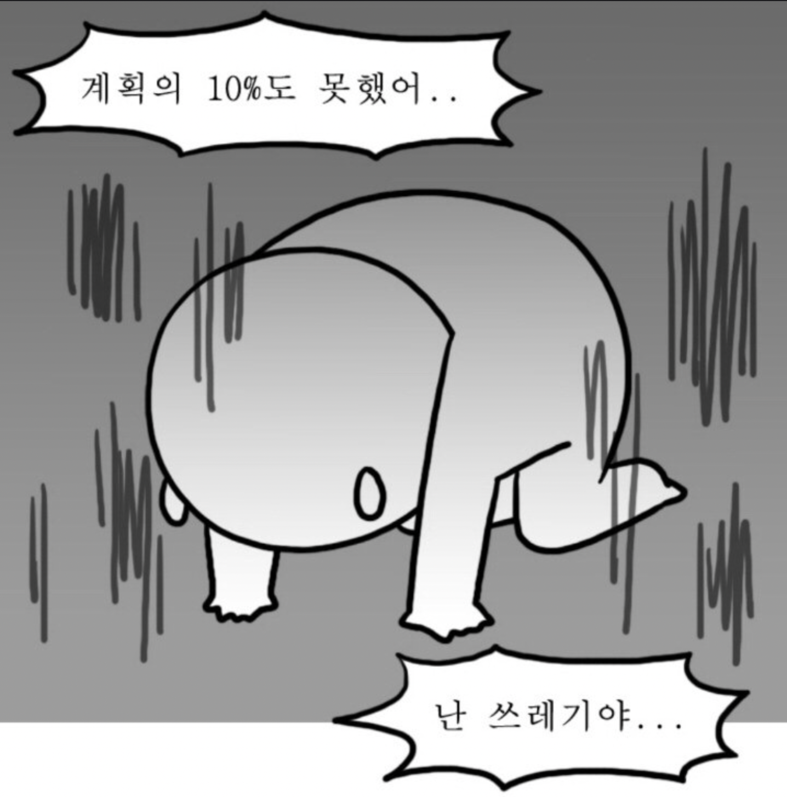

주말 내내 머리가 아파서 아무것도 못하고 누워있었다. 할게 너무 많은데 ㅠㅠ 

아직 리액트의 뒷부분 내용정리도 못하고 잔디도 못채우고..이번주는 **HA**를 준비하면서 리액트에 대해서만 알아봤던것 같다. 내일부터 들어가는 section2에서는 아예 처음이라 걱정이다.

# SECTION1 회고

##다짐..??같은 반성

34기에서 35기로 기수이동을 하면서 작성한 회고글이 나의 블로그의 첫번째 글이다.

그리고 그때를 되돌아 보며 전에 작성한 회고록을 다시 읽어봤다. 목표로 했던 일일 작성 블로그는 처음에는 잘 되나 싶었지만, 뒤에 내용이 어려워질수록 블로그까지 작성하면서 공부하기가 쉽지 않았다. 그러면서 주말을 쓰면서 많이 따라가고 있었지만 이번주는..완전 망했다....😱

블로그 양식도 리액트를 이용해서 만들고는 있지만 시간내기가 여간 힘든게 아니다. ('공부만 하고 살 순 없으니까..'라고 자기위안을 해본다...)

여러 핑계를 대봐도..어쨋든 나의 게으름이 잘못이다..SECTION2에서는 스스로에게 만족할 수 있게 잘해봐야지!! 다시한번 다짐해본다.

## 페어프로그램을 진행하면서 깨달은 공부법

기수이동을 하게 되면서 블로그를 작성할 여유가 좀 생겼고, 코딩을 처음 접하시는 분들을 페어로 많이 만나게 되었다. 그러면서 내가 아는 부분들을 최대한 정리하는 블로그를 작성하게 됐고, 페어분께 알려주려고 노력했는데 그러면서 얻어지는 부분들이 엄청 많은걸 알아버렸다. 정말 블로그 작성과 페어프로그래밍은 나에게 있어 가장 좋은 공부법이 아니였나 싶다. 그동안 공부 했던 방향에 대해 정리를 해보려고 한다.

- **나만의 블로그 작성법**
  
  1. 블로그에 작성할 내용을 큰 헤더부분만 작성한다.
  2. 작성할 내용을 제목만 보고 이해한 내용을 글로 적어본다.
  3. 코드스테이츠의 내용과 인터넷의 나와있는 내용을 다시한번 보면서 글을 정리한다.
  4. 이해한 내용을 바탕으로 직접 예시를 작성하고, 결과값을 추론해서 맞는지 확인해본다.
  5. 쓰면서 궁금했던 내용들은 바로 읽어보진 않더라도 꼭 링크를 걸어서 나중에라고 확인해본다.

- **페어프로그래밍**
  
  - 아는것을 설명하듯이 얘기하다보면 자기도 모르게 애매하게 알고 있었던 부분들을 확실히 알게된다.
  - 여러 방향성의 질문들을 듣다보면 생각치도 못한 모르는 부분이 나오게된다. 이 부분을 알고 넘어갈수 있다.
  - 문제풀이 과정에서 여러 방법들을 보게되고 좀 더 나은 방법을 찾게된다.
  - **스스로 더 열심히 노력하게되는 동기부여가 된다.**🤩
  
  *마지막 줄이 가장 도움이 됐던 부분인거 같다. 페어프로그래밍을 하다보면 몰랐던 부분을 채울수 있고, 아는 부분을 더 확실하게 알 수 있는 부분도 좋지만, 군대에서처럼 다른사람에게 피해를 주지 않기위해 더 열심히 하게 되는것 같다. 머리가 아파서 풀리지 않는 문제일지라도, 뭔가 더 끈기있게 끝까지 물고 늘어질 수 있는 원동력이 되기도 하는것 같다.*

## 그래도 한번 해보는 칭찬

비록 HA에서 advanced까지 전부 작성하고 제출하진 못했지만 (5분만 더 주어졌다면 다해서 냈을텐데!!) 시험시간이 끝나고서도 아쉬운 마음에 풀다보니 결국 다 풀어냈다.😁

Section1을 진행하면서 그래도 많이 알아가고 배웠고 익숙해졌다고 생각한다. GUI가 뭔지도 모르고 사용하던 내가, 20년동안 윈도우를 사용했음이 무색하게 맥북을 사용할때는 오히려 GUI보다 CLI가 더 편해졌고 윈도우 컴퓨터를 사용할때도 command키가 익숙해 alt키를 누르고 한영을 바꾸기위해 CapsLock키를 열심히 누르고 있으니..나름 열심히 한거 아닐까?

그동안 못하고 부족하다고 자책만 했으니 이렇게 섹션끝나고 기분좋은 회고를 쓸때는 한번씩 자기 칭찬해주는것도 좋은것 같다. 

###**🤗나 자신 칭찬해**👍👍👍
